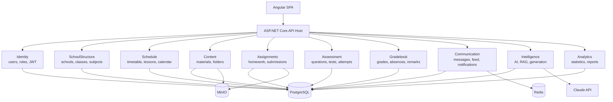
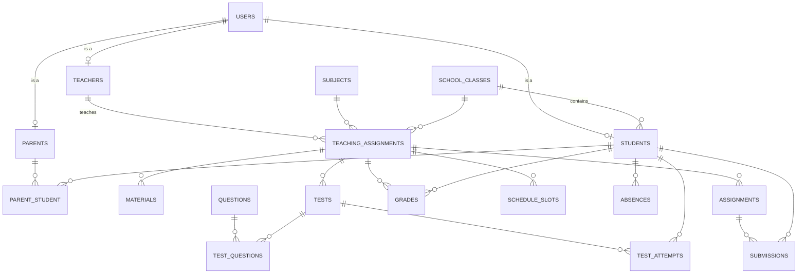

# Architecture Document — EduPlatform

**Version:** 1.0 · **Status:** approved for implementation

---

## Table of contents

1. [Technology choices — rationale](#1-technology-choices--rationale)
2. [Architectural style](#2-architectural-style)
3. [Modules and boundaries](#3-modules-and-boundaries)
4. [Solution structure](#4-solution-structure)
5. [Data model](#5-data-model)
6. [Roles and access control](#6-roles-and-access-control)
7. [API design](#7-api-design)
8. [Real-time communication](#8-real-time-communication)
9. [AI subsystem](#9-ai-subsystem)
10. [Security](#10-security)
11. [File storage](#11-file-storage)
12. [Deployment](#12-deployment)
13. [Observability](#13-observability)
14. [Testing strategy](#14-testing-strategy)
15. [Non-functional requirements](#15-non-functional-requirements)
16. [Accepted risks and deliberate trade-offs](#16-accepted-risks-and-deliberate-trade-offs)

---

## 1. Technology choices — rationale

### 1.1 Database: PostgreSQL 17

Alternatives considered: **MongoDB**, **Firebase Firestore**, **SQL Server**.

**Decision: PostgreSQL.** Reasoning:

| Criterion | Rationale |
|---|---|
| **Relational domain** | Student ↔ Class ↔ Subject ↔ Teacher ↔ Grade is a textbook relational model with many-to-many relationships. "Average grade per subject for the second term" is a single `GROUP BY`; in a document store it is an aggregation pipeline across four collections. |
| **Integrity** | Grades and absences are official records. They require ACID transactions and foreign keys — deleting a class must not leave orphaned grades behind. |
| **Flexibility** | `JSONB` columns cover the schema-less cases (test content, shuffled answer order, AI metadata) with full indexing support. Nothing is lost compared to NoSQL. |
| **AI readiness** | The `pgvector` extension provides vector search inside the same database. No separate vector store (Pinecone, Qdrant) is needed — one entire infrastructure component saved. |
| **Analytics** | Window functions, CTEs and materialized views cover performance statistics, trends and reports without an external tool. |
| **Operations** | Open source, no licensing, starts with one line in Docker, and has a mature Kubernetes operator (CloudNativePG) for production. |

**Why not MongoDB:** the lack of cross-collection transactional integrity and weak join support make performance calculation, parent reports and grade history disproportionately complex. The one area where it would fit (messages, logs) is covered by `JSONB` in PostgreSQL.

**Why not Firebase:** it is a managed BaaS that cannot be deployed to Kubernetes — which invalidates the entire DevOps portion of the project. Firestore has no joins and no server-side aggregations; security rules across four roles, classes and subjects become untestable; and billing is per document read, which penalizes exactly the dashboard-heavy UI this platform needs. Vendor lock-in is also a weak architectural position to defend in a thesis.

> **Firebase stays in the project in exactly one place:** Firebase Cloud Messaging for push notifications. That is a narrow, standard, free choice that does not couple the rest of the system to it.

### 1.2 Backend: ASP.NET Core 10

Alternatives considered: **Spring Boot 3**, **NestJS**.

| Criterion | Rationale |
|---|---|
| **Consistency with the frontend** | C# and TypeScript share an author and a language model. Dependency injection, `async/await`, decorators/attributes and generics look nearly identical — switching between the two halves of the project carries low cognitive cost. |
| **Real-time** | SignalR covers notifications, the class feed and test synchronization with minimal configuration, including automatic transport fallback and a Redis backplane for multiple instances. In Spring the same requires WebSocket + STOMP and manual wiring. |
| **Data access** | EF Core provides type-safe LINQ queries, transparent migrations and compiled queries. Compared to Hibernate it has noticeably fewer hidden traps (`LazyInitializationException`, unexpected N+1). |
| **Resource usage** | The container is ~110 MB and starts in under a second. With PostgreSQL, Redis, MinIO and the API all running on Docker Desktop, that difference against the JVM is tangible. |
| **Built-in subsystems** | ASP.NET Core Identity, Data Protection, Rate Limiting, Output Caching and Health Checks are part of the platform rather than third-party libraries. |

**Why not Spring Boot:** technically an equivalent choice; ruled out on higher memory usage during local development, more verbose configuration, and a larger stylistic gap from the Angular side.

**Why not NestJS:** a single language across the stack is appealing, but CPU-bound work (PDF processing, statistics, vectorization) is awkward in Node.js, and stack uniformity reduces the breadth of technologies demonstrated in the thesis.

### 1.3 Summary of decisions

| Decision | Choice | Primary reason |
|---|---|---|
| Database | PostgreSQL 17 + pgvector | Relational domain + built-in RAG |
| Backend | ASP.NET Core 10 (LTS) | Consistency with Angular, SignalR, EF Core |
| Architecture | Modular monolith | Clear boundaries without distributed complexity |
| Real-time | SignalR | Built in, with Redis backplane |
| File storage | MinIO | S3 API, runs in both Docker and Kubernetes |
| AI | Claude API | Long context, structured output, prompt caching |
| Embeddings | bge-m3 (self-hosted) | Multilingual, strong on Bulgarian, no per-request cost |

---

## 2. Architectural style

### 2.1 Modular monolith

The system is **one deployable application**, internally split into modules with explicitly defined boundaries.

**Boundary rules:**

1. Each module owns its **own PostgreSQL schema** (`identity`, `school`, `gradebook`, …).
2. A module **never reads another module's tables directly**. There are no foreign keys across schemas.
3. Inter-module communication happens in exactly two ways:
   - **Synchronously** — through a public interface in a `*.Contracts` project (e.g. `IStudentDirectory.GetStudentAsync`).
   - **Asynchronously** — through domain events on an in-process bus (`GradePublished`, `SubmissionReceived`).
4. Each module has its own `DbContext`.

### 2.2 Why not microservices

Having Kubernetes in the stack invites splitting into services. The opposite was chosen deliberately:

- The domain has **tightly coupled data** — a grade requires a student, a subject, a teacher and a term. Across separate services that means distributed transactions or eventual consistency, in a place where users expect immediate consistency.
- The data volume (one school, or a few) is **far below the threshold** at which independently scaling services pays off.
- Module boundaries are already enforced at the code level. If a real need arises, any module can be extracted into a standalone service without a rewrite — that is **the whole point of a modular monolith**.

Kubernetes is used for what it is good at: horizontally scaling the API, rolling updates, health probes, and managing configuration and secrets.

### 2.3 Internal structure of a module

Every module follows the same four-layer layout:

```
Modules/Gradebook/
├── Domain/            Entities, value objects, domain rules, domain events
├── Application/       Use cases (commands and queries), validation, interfaces
├── Infrastructure/    EF Core configurations, repositories, external adapters
└── Contracts/         Public contract for other modules (the only project referenced from outside)
```

Dependencies point **inward**: `Infrastructure → Application → Domain`. The domain depends on nothing.

**Application-layer pattern:** CQRS through a small hand-written dispatcher in `BuildingBlocks.Application` (see §2.4). Commands mutate state and publish events; queries read directly and project into DTOs without passing through domain entities.

### 2.4 No mediator library

The dispatcher, the handler interfaces and the behaviour pipeline are written by hand —
roughly 200 lines in `BuildingBlocks.Application/Messaging`. MediatR was the obvious
candidate and was rejected for one reason: from version 14 it ships under the Reciprocal
Public License 1.5, which obliges anyone who *deploys* software built on it — including
internally, inside a single school — to publish their source. That is incompatible with
releasing this platform under MIT and would quietly bind any school that later ran it.

The replacement is not a sacrifice. The contract a mediator provides here is three methods
(`SendAsync`, `SendAsync<TResult>`, `QueryAsync`) plus an ordered behaviour chain; the
implementation caches a closed generic wrapper per message type, so reflection is paid once
per type and never per request. Writing it also removes the usual criticism of mediator
libraries at a thesis defence — that they hide control flow behind a library the author
cannot explain.

---

## 3. Modules and boundaries



| Module | Responsibility | Key published events |
|---|---|---|
| **Identity** | Registration, login, roles, refresh tokens, password recovery | `UserRegistered`, `UserDeactivated` |
| **SchoolStructure** | Schools, academic years, terms, subjects, classes, enrollment, parent–child links, teaching assignments | `StudentEnrolled`, `TeachingAssignmentCreated` |
| **Schedule** | Weekly timetable, individual lessons, calendar events | `LessonScheduled`, `CalendarEventCreated` |
| **Content** | Learning materials, folders, file metadata | `MaterialPublished` |
| **Assignments** | Homework, submissions, review | `AssignmentPublished`, `SubmissionReceived`, `SubmissionGraded` |
| **Assessment** | Question bank, tests, attempts, auto-grading, timer | `TestPublished`, `AttemptSubmitted`, `AttemptGraded` |
| **Gradebook** | Grades, absences, remarks, performance calculation | `GradePublished`, `AbsenceRecorded`, `RemarkAdded` |
| **Communication** | Direct messages, class feed, notifications, push, e-mail | `MessageSent`, `NotificationCreated` |
| **Intelligence** | Material vectorization, RAG, summaries, question generation, feedback, cost tracking | `MaterialIndexed`, `QuestionsGenerated` |
| **Analytics** | Dashboard aggregations, parent and teacher reports, export | — |

**Example event flow:** a teacher grades a submitted assignment →
`SubmissionGraded` → `Gradebook` records a grade → `GradePublished` →
`Communication` creates notifications for the student and the parent → SignalR delivers them in real time, plus an FCM push.

---

## 4. Solution structure

```
src/
├── EduPlatform.Api/                          Host
│   ├── Program.cs                            Composition, middleware pipeline
│   ├── Endpoints/                            Minimal API groups per module
│   ├── Hubs/                                 SignalR: Notification, ClassFeed, Chat, TestSession
│   ├── Middleware/                           Exception handling, correlation ID
│   └── appsettings.*.json
│
├── BuildingBlocks/
│   ├── EduPlatform.BuildingBlocks.Domain/          Entity, AggregateRoot, IDomainEvent, ValueObject
│   ├── EduPlatform.BuildingBlocks.Application/     ICommand, IQuery, pipeline behaviours (validation, logging, transactions)
│   ├── EduPlatform.BuildingBlocks.Infrastructure/  Outbox, EF conventions, MinIO client, Claude client
│   └── EduPlatform.BuildingBlocks.Events/          In-process event bus
│
├── Modules/
│   ├── Identity/          {Domain, Application, Infrastructure, Contracts}
│   ├── SchoolStructure/   {Domain, Application, Infrastructure, Contracts}
│   ├── Schedule/          …
│   ├── Content/           …
│   ├── Assignments/       …
│   ├── Assessment/        …
│   ├── Gradebook/         …
│   ├── Communication/     …
│   ├── Intelligence/      …
│   └── Analytics/         …
│
└── web/                                       Angular 22
    ├── src/app/core/                          Interceptors, guards, SignalR service, auth
    ├── src/app/shared/                        UI components, pipes, directives
    ├── src/app/features/
    │   ├── student/  dashboard, schedule, homework, tests, grades, ai-assistant
    │   ├── teacher/  classes, materials, assignments, test-builder, grading, gradebook
    │   ├── parent/   overview, grades, absences, messages, ai-helper
    │   └── admin/    users, school-setup, audit
    └── src/app/layout/
```

**Reference rule:** `EduPlatform.Api` references every module. A module references **only** the `*.Contracts` projects of other modules, never their `Domain` or `Infrastructure`. This is enforced by architecture tests (NetArchTest) in CI.

---

## 5. Data model

Each group of tables lives in its own PostgreSQL schema. Key tables and their most important columns follow.

### 5.1 Core relational model



> **`teaching_assignments` is the central table of the model.** It joins *teacher + subject + class + academic year* and is the anchor point for materials, homework, tests, grades and the timetable. Nearly every authorization check goes through it.

### 5.2 Schema `identity`

| Table | Key columns |
|---|---|
| `users` | `id`, `email` (unique), `password_hash`, `first_name`, `last_name`, `phone`, `avatar_file_id`, `is_active`, `email_confirmed`, `created_at` |
| `roles` | `id`, `name` — `Student`, `Teacher`, `Parent`, `Admin` |
| `user_roles` | `user_id`, `role_id` |
| `refresh_tokens` | `id`, `user_id`, `token_hash`, `expires_at`, `revoked_at`, `replaced_by`, `device_info` |
| `audit_log` | `id`, `user_id`, `action`, `entity_type`, `entity_id`, `old_values` `jsonb`, `new_values` `jsonb`, `ip`, `created_at` |

### 5.3 Schema `school`

| Table | Key columns |
|---|---|
| `schools` | `id`, `name`, `city`, `address` |
| `academic_years` | `id`, `school_id`, `name` (`2026/2027`), `starts_on`, `ends_on`, `is_current` |
| `terms` | `id`, `academic_year_id`, `number` (1\|2), `starts_on`, `ends_on` |
| `subjects` | `id`, `school_id`, `name`, `code` |
| `school_classes` | `id`, `school_id`, `academic_year_id`, `grade` (1–12), `section` (`A`), `homeroom_teacher_id` |
| `teachers` | `id`, `user_id`, `school_id` |
| `students` | `id`, `user_id`, `school_class_id`, `student_number`, `enrolled_at` |
| `parents` | `id`, `user_id` |
| `parent_student` | `parent_id`, `student_id`, `relation` (`Mother`/`Father`/`Guardian`), `is_primary` |
| `teaching_assignments` | `id`, `teacher_id`, `subject_id`, `school_class_id`, `academic_year_id`, `weekly_hours` |

### 5.4 Schema `schedule`

| Table | Key columns |
|---|---|
| `schedule_slots` | `id`, `teaching_assignment_id`, `day_of_week`, `period_no`, `starts_at` `time`, `ends_at` `time`, `room`, `week_parity` (`All`/`Odd`/`Even`) |
| `lessons` | `id`, `teaching_assignment_id`, `schedule_slot_id`, `date`, `topic`, `status` |
| `calendar_events` | `id`, `school_class_id`, `teaching_assignment_id`, `type` (`Test`/`Exam`/`AssignmentDue`/`Holiday`/`Event`), `title`, `starts_at`, `ends_at`, `source_type`, `source_id` |

> `calendar_events` rows for tests and homework deadlines are created **automatically** from domain events (`TestPublished`, `AssignmentPublished`), never entered by hand.

### 5.5 Schema `content`

| Table | Key columns |
|---|---|
| `files` | `id`, `storage_key`, `original_name`, `content_type`, `size_bytes`, `sha256`, `uploaded_by_user_id`, `scan_status`, `created_at` |
| `material_folders` | `id`, `teaching_assignment_id`, `parent_folder_id`, `name`, `order_index` |
| `materials` | `id`, `teaching_assignment_id`, `folder_id`, `title`, `description`, `type` (`File`/`Link`/`Video`/`Text`), `file_id`, `url`, `is_published`, `published_at`, `indexing_status` |

### 5.6 Schema `assignments`

| Table | Key columns |
|---|---|
| `assignments` | `id`, `teaching_assignment_id`, `title`, `description`, `assigned_at`, `due_at`, `max_points`, `allow_late`, `late_penalty_pct`, `is_published` |
| `assignment_attachments` | `assignment_id`, `file_id` |
| `submissions` | `id`, `assignment_id`, `student_id`, `status` (`Draft`/`Submitted`/`Late`/`Graded`/`Returned`), `text`, `submitted_at`, `points`, `teacher_comment`, `graded_at`, `graded_by_teacher_id` |
| `submission_files` | `submission_id`, `file_id` |

Unique index on `(assignment_id, student_id)` — a student has at most one submission per assignment.

### 5.7 Schema `assessment`

| Table | Key columns |
|---|---|
| `question_banks` | `id`, `subject_id`, `owner_teacher_id`, `name`, `is_shared` |
| `questions` | `id`, `bank_id`, `type` (`SingleChoice`/`MultiChoice`/`TrueFalse`/`ShortAnswer`/`Open`), `text`, `points`, `difficulty` (1–5), `explanation`, `source_material_id`, `is_ai_generated`, `approved_by_teacher_id` |
| `question_options` | `id`, `question_id`, `text`, `is_correct`, `order_index` |
| `tests` | `id`, `teaching_assignment_id`, `title`, `duration_minutes`, `opens_at`, `closes_at`, `shuffle_questions`, `shuffle_options`, `max_attempts`, `results_policy`, `total_points`, `is_published` |
| `test_questions` | `test_id`, `question_id`, `order_index`, `points_override` |
| `test_attempts` | `id`, `test_id`, `student_id`, `attempt_no`, `started_at`, **`expires_at`**, `submitted_at`, `status`, `score`, `ai_feedback` |
| `attempt_questions` | `id`, `attempt_id`, `question_id`, `order_index`, `option_order` `jsonb` |
| `attempt_answers` | `id`, `attempt_id`, `question_id`, `selected_option_ids` `jsonb`, `text_answer`, `is_correct`, `points_awarded`, `answered_at` |

**Question shuffling.** When an attempt starts, the server generates the question order and the option order and persists them in `attempt_questions`. The ordering is **fixed for that attempt** — reloading the page shows the student the same thing. Shuffling never happens in the browser.

**Timer.** `expires_at` is computed **on the server** at start (`started_at + duration_minutes`, capped by `closes_at`). The client counts down for display only; any answer saved after `expires_at` is rejected. A Hangfire job automatically finalizes expired attempts. Tampering with the browser clock has no effect.

### 5.8 Schema `gradebook`

| Table | Key columns |
|---|---|
| `grades` | `id`, `student_id`, `teaching_assignment_id`, `term_id`, `value` `numeric(3,2)` (2.00–6.00), `grade_type` (`Current`/`Term`/`Annual`/`Exam`), `reason` (`Oral`/`Written`/`Test`/`Homework`/`Project`/`Activity`), `weight`, `comment`, `given_at`, `teacher_id`, `source_type`, `source_id` |
| `absences` | `id`, `student_id`, `teaching_assignment_id`, `lesson_id`, `date`, `type` (`Excused`/`Unexcused`/`Late`), `note`, `excuse_file_id`, `recorded_by_teacher_id` |
| `remarks` | `id`, `student_id`, `teacher_id`, `type` (`Praise`/`Remark`), `text`, `is_visible_to_parent`, `created_at` |

`source_type` / `source_id` provide **traceability**: a grade derived from a test points back to the `test_attempts` row. The student can see where every grade came from.

### 5.9 Schema `communication`

| Table | Key columns |
|---|---|
| `conversations` | `id`, `type` (`Direct`/`Group`), `school_class_id`, `subject` |
| `conversation_participants` | `conversation_id`, `user_id`, `last_read_at`, `is_muted` |
| `messages` | `id`, `conversation_id`, `sender_user_id`, `body`, `sent_at`, `edited_at`, `is_deleted` |
| `class_posts` | `id`, `teaching_assignment_id`, `school_class_id`, `author_user_id`, `body`, `pinned_at`, `created_at` |
| `post_comments` | `id`, `post_id`, `author_user_id`, `body`, `created_at` |
| `notifications` | `id`, `user_id`, `type`, `title`, `body`, `payload` `jsonb`, `is_read`, `created_at`, `read_at` |
| `notification_preferences` | `user_id`, `notification_type`, `in_app`, `email`, `push` |
| `device_tokens` | `id`, `user_id`, `fcm_token`, `platform`, `last_seen_at` |
| `outbox_messages` | `id`, `type`, `payload` `jsonb`, `occurred_at`, `processed_at`, `error` |

`outbox_messages` implements the **transactional outbox** pattern — the notification is written in the same transaction as the grade, while delivery happens separately. It is therefore impossible to record a grade without its notification, or vice versa.

### 5.10 Schema `intelligence`

| Table | Key columns |
|---|---|
| `material_chunks` | `id`, `material_id`, `chunk_index`, `content`, `token_count`, `embedding` `vector(1024)`, `page_no` |
| `ai_conversations` | `id`, `user_id`, `scope` (`Material`/`Test`/`General`), `related_entity_id`, `title`, `created_at` |
| `ai_messages` | `id`, `conversation_id`, `role`, `content`, `model`, `input_tokens`, `output_tokens`, `cache_read_tokens`, `cost_usd`, `latency_ms`, `created_at` |
| `ai_generation_jobs` | `id`, `type` (`Summary`/`QuestionGeneration`/`Feedback`), `source_id`, `status`, `result` `jsonb`, `error`, `requested_by_user_id`, `created_at`, `completed_at` |
| `ai_usage_quotas` | `user_id`, `period_start`, `requests_used`, `tokens_used` |

Vector search index:

```sql
CREATE INDEX ON intelligence.material_chunks
  USING hnsw (embedding vector_cosine_ops);
```

---

## 6. Roles and access control

### 6.1 Permission matrix

| Action | Student | Teacher | Parent | Admin |
|---|:--:|:--:|:--:|:--:|
| View own timetable | ✅ | ✅ | ✅¹ | ✅ |
| View materials | ✅² | ✅³ | ✅¹ | ✅ |
| Upload materials | ❌ | ✅³ | ❌ | ✅ |
| Create homework | ❌ | ✅³ | ❌ | ❌ |
| Submit homework | ✅² | ❌ | ❌ | ❌ |
| Grade work | ❌ | ✅³ | ❌ | ❌ |
| View grades | ✅¹ | ✅³ | ✅¹ | ✅ |
| Create a test | ❌ | ✅³ | ❌ | ❌ |
| Take a test | ✅² | ❌ | ❌ | ❌ |
| Record an absence | ❌ | ✅³ | ❌ | ✅ |
| Submit an absence excuse | ❌ | ✅³ | ✅¹ | ✅ |
| Message a teacher | ✅ | ✅ | ✅ | ✅ |
| Post to the class feed | ❌ | ✅³ | ❌ | ✅ |
| Use the AI assistant | ✅ | ✅ | ✅ | ✅ |
| AI question generation | ❌ | ✅ | ❌ | ✅ |
| Manage users | ❌ | ❌ | ❌ | ✅ |
| Create classes/subjects | ❌ | ❌ | ❌ | ✅ |

¹ own data only / own child's data only · ² only for the class they are enrolled in · ³ only for their own teaching assignments

### 6.2 Implementation

Role checks (`[Authorize(Roles = ...)]`) provide only coarse protection. The real enforcement is **resource-based authorization** via ASP.NET Core `IAuthorizationHandler`:

- `TeacherOwnsAssignmentRequirement` — does the teacher hold a `teaching_assignment` for this resource
- `StudentInClassRequirement` — is the student enrolled in the resource's class
- `ParentOfStudentRequirement` — is there a row in `parent_student`
- `SameSchoolRequirement` — baseline isolation between schools

Every query is additionally filtered by **EF Core global query filters** on school and role, so that even a missed check cannot return a resource from another context.

---

## 7. API design

### 7.1 Conventions

- **Minimal API**, grouped per module; each endpoint is its own class (REPR pattern).
- Versioning in the path: `/api/v1/...`
- Pagination: `?page=1&pageSize=20` → response `{ items, page, pageSize, totalCount }`
- Errors: **RFC 9457 Problem Details**, including a `traceId` for log correlation.
- Validation: FluentValidation as a MediatR pipeline behaviour → `400` with a per-field list.
- Documentation: OpenAPI + Scalar UI at `/scalar`.
- Optimistic concurrency: `ETag` / `If-Match` when editing grades and tests.

### 7.2 Main endpoints

**Authentication**
```
POST   /api/v1/auth/register
POST   /api/v1/auth/login
POST   /api/v1/auth/refresh
POST   /api/v1/auth/logout
POST   /api/v1/auth/forgot-password
POST   /api/v1/auth/reset-password
GET    /api/v1/auth/me
```

**School structure (admin)**
```
GET    POST   /api/v1/schools/{id}/classes
GET    POST   /api/v1/schools/{id}/subjects
POST          /api/v1/classes/{id}/students
POST          /api/v1/teaching-assignments
POST          /api/v1/students/{id}/parents
```

**Timetable and calendar**
```
GET    /api/v1/schedule/me?week=2026-W38
GET    /api/v1/schedule/class/{classId}
GET    /api/v1/calendar/me?from=&to=
```

**Materials**
```
GET    POST   /api/v1/teaching-assignments/{id}/materials
GET    PUT    DELETE  /api/v1/materials/{id}
POST          /api/v1/files            presigned upload
GET           /api/v1/files/{id}       presigned download
```

**Homework**
```
GET    POST   /api/v1/teaching-assignments/{id}/assignments
GET    PUT    /api/v1/assignments/{id}
GET           /api/v1/assignments/me?status=pending
POST          /api/v1/assignments/{id}/submissions
GET           /api/v1/assignments/{id}/submissions      teacher
POST          /api/v1/submissions/{id}/grade
```

**Tests**
```
GET    POST   /api/v1/question-banks/{id}/questions
GET    POST   /api/v1/teaching-assignments/{id}/tests
POST          /api/v1/tests/{id}/publish
POST          /api/v1/tests/{id}/attempts            start an attempt
GET           /api/v1/attempts/{id}                  questions in shuffled order
PUT           /api/v1/attempts/{id}/answers/{qid}    autosave
POST          /api/v1/attempts/{id}/submit
GET           /api/v1/attempts/{id}/result
GET           /api/v1/tests/{id}/statistics          teacher
```

**Gradebook**
```
GET    POST   /api/v1/students/{id}/grades
GET           /api/v1/gradebook/{teachingAssignmentId}
POST          /api/v1/students/{id}/absences
POST          /api/v1/absences/{id}/excuse
GET           /api/v1/students/{id}/performance?termId=
```

**Communication**
```
GET    POST   /api/v1/conversations
GET    POST   /api/v1/conversations/{id}/messages
GET    POST   /api/v1/classes/{id}/posts
GET           /api/v1/notifications?unreadOnly=true
POST          /api/v1/notifications/{id}/read
POST          /api/v1/devices                        FCM registration
```

**AI**
```
POST   /api/v1/ai/chat                     SSE streaming
POST   /api/v1/ai/materials/{id}/summary
POST   /api/v1/ai/materials/{id}/questions teacher, generates drafts
POST   /api/v1/ai/attempts/{id}/feedback
GET    /api/v1/ai/usage
```

---

## 8. Real-time communication

SignalR with a **Redis backplane**, so it keeps working across multiple replicas in Kubernetes.

| Hub | Groups | Client events |
|---|---|---|
| `NotificationHub` | `user:{userId}` | `NotificationReceived`, `UnreadCountChanged` |
| `ClassFeedHub` | `class:{classId}` | `PostCreated`, `CommentAdded`, `PostPinned` |
| `ChatHub` | `conversation:{id}` | `MessageReceived`, `UserTyping`, `MessageRead` |
| `TestSessionHub` | `attempt:{id}` | `TimeSync`, `TestClosingSoon`, `AttemptAutoSubmitted` |

**`TestSessionHub`** solves a specific problem: the client-side timer can drift when a device sleeps or the network drops. The hub pushes the authoritative remaining time every 15 seconds and warns at 5 minutes and 1 minute remaining. Authentication uses the JWT passed via query string during the handshake.

---

## 9. AI subsystem

### 9.1 Principles

1. **The key never leaves the server.** Angular only ever calls our own backend.
2. **The teacher stays in control.** AI-generated questions are stored as drafts (`is_ai_generated = true`, `approved_by_teacher_id = null`) and enter a test only after approval.
3. **Answers are grounded in the material.** RAG over the teacher's uploaded documents, not general knowledge.
4. **Cost is measured.** Every call records tokens and cost in `ai_messages`; per-user quotas apply.

### 9.2 Model selection

| Model | Price in / out (per 1M tokens) | Used for |
|---|---|---|
| `claude-opus-5` | $5 / $25 | Test question generation, post-test feedback, explaining difficult topics |
| `claude-haiku-4-5` | $1 / $5 | Short summaries, FAQ answers, title and keyword extraction |

Defaults: `thinking: { type: "adaptive" }` for non-trivial tasks, and `output_config.effort` scaled to the task (`low` for summaries, `high` for question generation).

### 9.3 Cost optimization

| Mechanism | Effect |
|---|---|
| **Prompt caching** | The learning material is marked as a cached prefix. When 25 students ask about the same lesson, repeat requests read from cache — up to 90% cheaper. |
| **Message Batches API** | Nightly summaries of newly uploaded materials and bulk post-test feedback go through the batch API — **50% discount**, latency irrelevant. |
| **Model routing** | Simple tasks go to Haiku, complex ones to Opus. |
| **Quotas** | Per-user request and token limits per period, tracked in `ai_usage_quotas`. |
| **Result caching** | A material's summary is computed once and stored; it is recomputed only when the file changes (compared by `sha256`). |

### 9.4 RAG pipeline

```
Teacher uploads a PDF
   ↓  MaterialPublished (domain event)
Hangfire job: text extraction (PdfPig)
   ↓
Chunking, ~800 tokens with 100-token overlap
   ↓
Vectorization with bge-m3 (self-hosted, 1024 dimensions)
   ↓
Stored in intelligence.material_chunks (pgvector, HNSW index)

--- when a student asks a question ---

Question → vectorized → hybrid search:
    cosine similarity (pgvector) + full-text (PostgreSQL tsvector)
   ↓
Top 8 chunks, filtered by the student's permissions
   ↓
Claude API: system prompt + context (cached) + question
   ↓
SSE stream to Angular, with citations back to the source (material, page)
```

**Why self-hosted embeddings:** `bge-m3` performs strongly on Bulgarian, runs in its own container, has no per-request cost, and keeps learning content from leaving the system. Vectorization is a background job, so its latency is never felt by the user.

### 9.5 Test question generation

Uses **structured output** (`output_config.format` with a JSON schema) rather than free text plus parsing. The schema describes an array of questions with type, text, options, correct answer, explanation and difficulty. The result is validated and stored as draft questions.

The teacher gets a review screen where each question can be edited, deleted or approved. **No unapproved question ever reaches a student.**

### 9.6 Post-test feedback

Once an attempt is finalized, a background job collects the questions, the student's answers, the correct answers and the topics involved. Claude produces a short analysis — which topics are mastered, which are not, and specifically what to revise, pointing at the exact material. The result is stored in `test_attempts.ai_feedback`.

### 9.7 Limits and safety

- Content from user documents is treated as **data, not instructions** — the system prompt explicitly requires ignoring any commands found inside materials (prompt-injection defence).
- Rate limiting on AI endpoints, separate from the global limiter.
- Every AI response carries a visible "AI-generated" label.
- If the AI provider is unavailable, the feature degrades gracefully — the platform keeps working without AI.

---

## 10. Security

| Area | Measure |
|---|---|
| Passwords | ASP.NET Core Identity, Argon2id / PBKDF2 with a high work factor |
| Tokens | Short-lived JWT access token (15 min) + rotating refresh token in an `HttpOnly`, `Secure`, `SameSite=Strict` cookie |
| Authorization | Roles + resource policies + global query filters (three independent layers) |
| Transport | HTTPS everywhere, HSTS, TLS termination at the ingress |
| Headers | CSP, `X-Content-Type-Options`, `Referrer-Policy`, `X-Frame-Options` |
| Injection | Parameterized queries through EF Core; concatenated SQL banned (enforced by an analyzer) |
| File uploads | Size and MIME type limits, magic-byte verification, ClamAV scanning, storage outside the web root, short-lived presigned URLs |
| Rate limiting | Built-in ASP.NET Core rate limiter: per IP for login, per user for AI |
| Auditing | Every change to a grade, absence or role is written to `audit_log` |
| Secrets | User Secrets locally; Kubernetes Secrets / Sealed Secrets in production; nothing in Git |
| Personal data | Parental consent for minors, deletion on request, data minimization (GDPR) |
| Dependencies | `dotnet list package --vulnerable` and `npm audit` in CI; Dependabot |

**Child data isolation.** A parent sees data only for children they have a `parent_student` row for. The check exists in both the authorization handler *and* the query filter — compromising one does not expose data.

---

## 11. File storage

**MinIO**, S3-compatible, behaves identically in local Docker and in Kubernetes.

| Bucket | Contents | Presigned URL lifetime |
|---|---|---|
| `materials` | Learning materials | 15 min |
| `submissions` | Submitted homework | 15 min |
| `avatars` | Profile pictures | 1 hour |
| `exports` | Generated reports, PDFs | 5 min |

**Upload flow:** the client requests a presigned URL from the API → uploads **directly** to MinIO → notifies the API with the object key → the API records metadata in `files`. Large files never pass through the application server.

Limits: 50 MB per file, 200 MB per submission. Allowed types: PDF, DOCX, PPTX, XLSX, PNG, JPG, ZIP, MP4.

---

## 12. Deployment

### 12.1 Local development

`docker compose up -d` starts PostgreSQL (+pgvector), Redis, MinIO, Mailpit, Seq and the embedding-model container. The API and Angular run directly on the host for fast hot reload.

### 12.2 Kubernetes

```
ingress-nginx (TLS via cert-manager)
        │
   ┌────┴────┐
   ▼         ▼
angular   api (Deployment, 2 replicas, HPA)
(nginx)      │
             ├── postgres (StatefulSet, CloudNativePG)
             ├── redis (StatefulSet)
             ├── minio (StatefulSet)
             └── embeddings (Deployment)
```

- **Configuration:** ConfigMap for settings, Secret for credentials.
- **Probes:** `/health/live` and `/health/ready` (ASP.NET Core Health Checks) — `ready` verifies PostgreSQL, Redis and MinIO.
- **Migrations:** a separate Kubernetes `Job` executed before rollout — never on application startup, so replicas cannot race each other.
- **Rolling update** with `maxUnavailable: 0`.
- **Packaging:** a Helm chart with `values-dev.yaml` and `values-prod.yaml`.

### 12.3 CI/CD (GitHub Actions)

```
push / PR
  ├─ build + unit tests
  ├─ integration tests (Testcontainers)
  ├─ architecture tests (NetArchTest)
  ├─ Angular build + tests
  ├─ vulnerability scan
  └─ [on main] docker build → GHCR → helm upgrade
```

---

## 13. Observability

| Pillar | Tool | Contents |
|---|---|---|
| Logs | Serilog → Seq (local) / OTLP (production) | Structured, with `TraceId`, `UserId`, `Module` |
| Metrics | OpenTelemetry → Prometheus → Grafana | Latency and errors per endpoint, Hangfire queue depth, AI tokens and cost, active SignalR connections, EF Core queries |
| Tracing | OpenTelemetry → Jaeger | HTTP → MediatR → EF Core → external calls |
| Health | ASP.NET Core Health Checks | `/health/live`, `/health/ready` |

A Grafana dashboard of business metrics (submissions made, tests started, daily AI spend) makes a strong illustration during the defense.

---

## 14. Testing strategy

| Level | Tool | Scope |
|---|---|---|
| Unit | xUnit + Shouldly | Domain rules: performance calculation, test scoring, late submission, grade validity |
| Integration | xUnit + **Testcontainers** | Real PostgreSQL container; EF configurations, migrations, access rules, transactions |
| API | `WebApplicationFactory` | Full HTTP round trip with authentication; verifies a student cannot reach another student's data |
| Architecture | NetArchTest | A module never references another module's internals; the domain has no infrastructure dependencies |
| Frontend | Jest + Testing Library | Components, guards, interceptors |
| E2E | **Playwright** | Critical per-role scenarios |
| Load | k6 | 200 concurrent students taking a test |

**Mandatory E2E scenarios:**
1. Teacher creates homework → student submits → teacher grades → student and parent receive notifications.
2. Teacher generates questions with AI → approves them → publishes a test → student takes it with the timer → receives result and feedback.
3. Parent logs in, sees a new grade and an absence, sends a message to the teacher.
4. Timer expires with the tab closed → the attempt is auto-submitted and answers are preserved.

---

## 15. Non-functional requirements

| Requirement | Target |
|---|---|
| Responsiveness | p95 < 300 ms for read endpoints |
| Concurrent users | 500 active, 200 simultaneously taking a test |
| Accessibility | WCAG 2.1 level AA |
| Responsive design | Full functionality from 360 px upward |
| Languages | Bulgarian (primary), English (i18n structure prepared) |
| Browsers | Latest two versions of Chrome, Firefox, Edge, Safari |
| Recovery | Daily PostgreSQL backup, RPO 24 h, RTO 4 h |
| Availability | 99% on school days, 07:00–20:00 |

---

## 16. Accepted risks and deliberate trade-offs

| Decision | Trade-off | Why it is acceptable |
|---|---|---|
| Modular monolith | A single module cannot be scaled independently | The volume does not require it; the boundaries allow extraction when it does |
| Hand-written dispatcher instead of MediatR | ~200 lines to own and test | Avoids the RPL-1.5 source-disclosure obligation MediatR 14 places on deployers |
| Single PostgreSQL instance | Single point of failure | CloudNativePG provides a replica and automatic failover; sharding complexity is unjustified |
| Self-hosted embeddings | One more container and ~2 GB RAM | No per-request cost, better Bulgarian, data never leaves the system |
| AI depends on an external provider | An outage disables AI features | Degrades gracefully — the platform works without AI; results are cached |
| No offline mode | Requires connectivity | The target environment is a school with internet; PWA offline support is listed as future work |
| Scoped to a single school | Multi-tenancy is not fully implemented | The schema already carries `school_id` throughout — the extension is mechanical |
